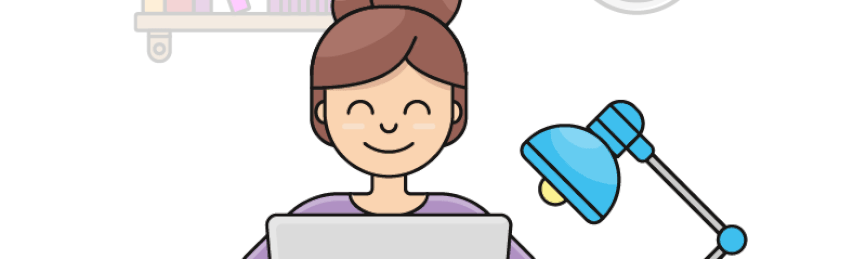

  

<h2 align="center">Hi 👋, I'm Karen Kanana</h2>
<h4 align="center">I am a proactive, hard-working, enthusiastic, and highly skilled web developer based in Nairobi, Kenya.</h4>

  

### Connect with Me:

 

 

### Languages and Tools:

     <a href="https://redux.js.org" target="_blank" rel="noreferrer"><a href="https://www.ruby-lang.org/en/" target="_blank" rel="noreferrer"><a href="https://sass-lang.com" target="_blank" rel="noreferrer">

### :octocat: My stats:

&nbsp;

### Get in touch:
- muthomikarenkanana@gmail.com

I'm always engaged in various projects, and my enthusiasm sometimes prevents me from taking the time to update my portfolio. If you're interested in what I'm up to now, don't hesitate to reach out to me :wink:

